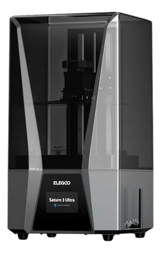

  

# Elegoo Saturn 3 Ultra - Home Assistant Integration

Integração para o **Home Assistant** que permite monitorar e controlar sua impressora de resina **Elegoo Saturn 3 Ultra** diretamente no seu dashboard.

## 🚀 Funcionalidades

- **Monitoramento em Tempo Real**:
  - Status da máquina (Idle, Printing, Paused, Error).
  - Progresso da impressão e camada atual.
  - Nome do arquivo e tempo restante.
  - Previsão de término (Data/Hora).
- **Controles Remotos**: Botoões de **Pausar**, **Retomar** e **Parar** impressão.
- **Configuração via Interface**: Nada de YAML, configure tudo pela interface do HA.

## 🛠️ Instalação Passo a Passo

### 1. Pelo HACS (Recomendado)
A melhor forma de manter a integração atualizada.

1.  No seu Home Assistant, abra o **HACS**.
2.  Clique nos **três pontinhos** no canto superior direito e selecione **Custom repositories** (Repositórios personalizados).
3.  No campo **Repository**, cole a URL: `https://github.com/gabrielbolzani/Elegoo_Saturn_3_ultra_HomeAssistant_Integration`
4.  No campo **Category**, selecione **Integration**.
5.  Clique em **ADD**.
6.  Agora, procure por **Elegoo Saturn 3 Ultra** na lista do HACS e clique em **Download**.
7.  **Reinicie o Home Assistant**.

---

## ⚙️ Configuração

Após reiniciar o Home Assistant, siga estes passos para adicionar sua impressora:

1.  Vá em **Configurações** > **Dispositivos e Serviços**.
2.  Clique no botão **+ ADICIONAR INTEGRAÇÃO** no canto inferior direito.
3.  Pesquise por **Elegoo Saturn 3 Ultra** e selecione-a.
4.  Um formulário aparecerá solicitando:
    - **Nome da Máquina**: Como você quer que ela apareça no HA (ex: Saturn 3 Ultra Oficina).
    - **Endereço IP**: O IP atual da sua impressora na sua rede local.
5.  Clique em **Enviar**.

**Dica**: Recomenda-se fixar o IP da impressora nas configurações do seu roteador (DHCP Estático) para evitar que a integração perca a conexão caso o IP mude.

---
*Desenvolvido por Gabriel Bolzani*
